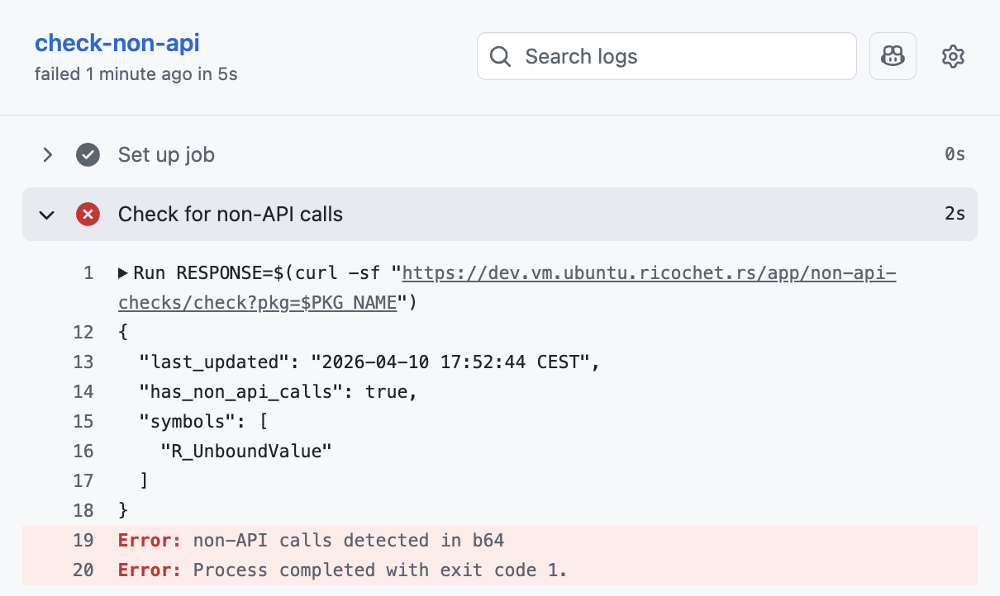

# CRAN non-API Call Checker

A small [plumber](https://www.rplumber.io/) REST API for checking whether a CRAN package uses non-API calls to R internals.

The API is deployed on [ricochet](https://ricochet.rs) at `https://dev.vm.ubuntu.ricochet.rs/app/non-api-checks`.




## Background

R-core is actively working to clarify and tighten the C API for extending R. As part of this effort, entry points intended for internal use are being removed from installed header files or hidden. Packages that rely on these non-API symbols will break as R evolves.

This API was built to help the [extendr](https://extendr.rs/) project track which R internal symbols it binds to are still permitted, so the project can stay ahead of breaking changes in base R.

## API


### `GET /check?pkg=<name>`

**Example:**

```
GET /check?pkg=b64
```

**Response:**

```json
{
  "last_updated": "2026-04-10 17:52:44 CEST",
  "has_non_api_calls": true,
  "symbols": ["R_UnboundValue"]
}
```

## GitHub Actions

A workflow template is provided at [`.github/workflows/check-non-api.yaml`](.github/workflows/check-non-api.yaml). Copy it into your repository and set `PKG_NAME` to your CRAN package name.

The workflow runs on push and daily at 8am UTC. If non-API calls are detected it prints the full JSON response and fails the job with an error annotation.

## References

- [Writing R Extensions §6.23 — Moving into C API compliance](https://cran.r-project.org/doc/manuals/R-exts.html#Moving-into-C-API-compliance)
- [CRAN check results](https://cloud.r-project.org/web/checks/)
- [extendr](https://extendr.rs/)
- [ricochet](https://ricochet.rs/)
